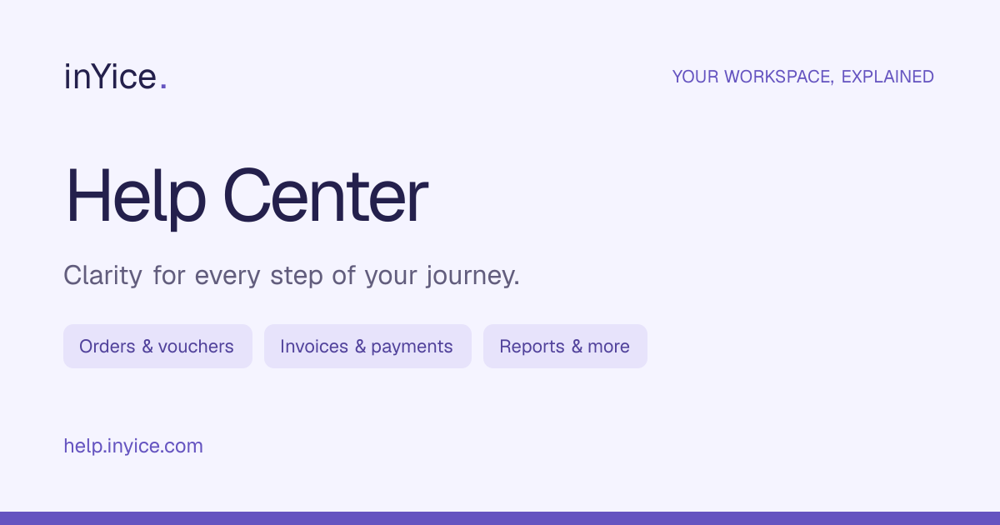

<div align="center">

# inYice Help Center

**Clarity for every step of your journey.**

Step-by-step guidance for the inYice travel agency workspace, from your first booking to your next financial report.

[Help Center](https://help.inyice.com) · [Page Directory](https://help.inyice.com/pages) · [Integration File](exports/main-project-help-links.txt)

**54 guides · 39 portal page mappings · 6 topics**



**Next.js 16 · React 19 · TypeScript · Docker**

</div>

---

## Guidance for everyday work

Searchable guides, reviewed screenshots, and direct help links make it easier for users to find instructions for the page they are working on.

| Topic | What users can learn |
| --- | --- |
| Getting started | Register, sign in, recover access, and navigate the workspace |
| Orders & vouchers | Create bookings, edit orders, and share travel documents |
| Invoices & sharing | Manage invoices, understand statuses, and share documents |
| Receipts & payments | Record customer and supplier transactions |
| Reports & statements | Review financial activity, performance, and balances |
| Company & team | Manage company details, users, customers, and vendors |

The site includes responsive layouts, light and dark themes, local search, printable articles, and browser-local feedback. One application serves the pages and assets. No database or external AI service is required.

## Quick start

Use **Node.js 22.18+ or Node.js 24** and npm.

```bash
npm ci
npm run dev
```

Open **http://localhost:3001**.

### Production build

```bash
npm run build
npm start
```

The build runs content tests, refreshes the help-links export, prerenders pages, and packages the server and assets into `.next/standalone`. `npm start` serves it on port `3001`. Set `PORT` or `HELP_HOSTNAME` to change the production port or listen address.

## Connect help icons to the main project

**Copy [exports/main-project-help-links.txt](exports/main-project-help-links.txt) to the main project.**

It contains **39 agency/public route mappings**, their relevant help URLs, and all **54 guides** for contextual links within tabs and actions.

1. Match each main-project page to its route in the file.
2. Add a help icon beside the page title with an accessible label and tooltip.
3. Open the relevant guide in a new tab so users retain their current work.

Example for the Orders page:

```html
<a
  href="https://help.inyice.com/articles/orders-page"
  target="_blank"
  rel="noopener noreferrer"
  aria-label="Help with Orders"
  title="Help with Orders"
>
  <!-- Replace with your help icon -->
  Help
</a>
```

Use your router's pattern matching for `:uid` and `:token`. Ignore query strings and hashes, match specific routes first, and use the wildcard only as a fallback. Never put actual tokens or private values into help URLs. For an unmapped screen, use `https://help.inyice.com/pages`.

Refresh the handoff after changing guides or route mappings:

```bash
npm run export:help-links
```

Confirm the mappings against the current main-project router before integration. Provider/internal pages are excluded.

## Deploy on a VPS with Docker

The image builds the app for Linux and runs the standalone server as a non-root user. Compose includes a restart policy, bounded logs, and a health check.

From the project directory on your VPS:

```bash
cp .env.example .env
docker compose up -d --build
docker compose ps
curl --fail http://127.0.0.1:3001/api/health
```

### Docker manager settings

| Setting | Value |
| --- | --- |
| Compose file | `docker-compose.yml` |
| Dockerfile | `Dockerfile` |
| Build context | Project root (`.`) |
| Container HTTP port | `3001` |
| Health endpoint | `/api/health` |
| Production domain | `help.inyice.com` |
| Database / persistent volumes | None required |

Upload the source or connect its Git repository in your manager. Pasted Compose YAML alone cannot build `build: .` without the source files. If your manager requires a registry image, build and push the image first and replace the build configuration with that image reference.

### Network and HTTPS

The default host binding is **`0.0.0.0:3001`**, publishing container port `3001` on all VPS interfaces. Allow inbound TCP port `3001` in the VPS firewall for direct access at `http://VPS_IP:3001`. Create an A record for `help.inyice.com` pointing to the VPS IPv4 address.

DNS does not select a port. To serve `https://help.inyice.com` without `:3001`, configure a reverse proxy on ports `80` and `443` with a TLS certificate, forwarding to the app on port `3001`. A reverse proxy running directly on the VPS can use `http://127.0.0.1:3001`; preserve host and forwarding headers.

| Compose variable | Default | Purpose |
| --- | --- | --- |
| `HELP_BIND_ADDRESS` | `0.0.0.0` | Host interface for the published port |
| `HELP_PORT` | `3001` | Published host port; the container stays on `3001` |

Set these in the VPS `.env` or the manager's Compose environment. If an existing deployment sets `HELP_BIND_ADDRESS=127.0.0.1`, change it to `0.0.0.0` for direct VPS access, then redeploy the `help-inyice` project. Use `127.0.0.1` when only a reverse proxy running on the host should access the published port.

If the reverse proxy is another container, attach both services to a shared Docker network and use `http://help:3001`. Its own `127.0.0.1` does not point to this app.

<details>
<summary><strong>Updates and troubleshooting</strong></summary>

After pulling or uploading updated source:

```bash
docker compose up -d --build
docker compose logs --tail=100 help
```

A single-container update can briefly interrupt traffic. The restart policy restarts stopped containers; an unhealthy status alone does not trigger a restart.

Without Docker, copy the complete `.next/standalone` directory, including its hidden `.next` folder. Run `node server.js` with `PORT=3001` and `HOSTNAME=0.0.0.0`. Build on the target operating system so native dependencies match.

</details>

## Social sharing and discovery

Pages have their own titles, descriptions, canonical URLs, and Open Graph/Twitter metadata. A branded **1200 × 630 PNG** supplies the social preview.

| Endpoint | Purpose |
| --- | --- |
| `/social-image` | Branded sharing image generated at build time |
| `/sitemap.xml` | Canonical public page index |
| `/robots.txt` | Crawler rules and sitemap location |
| `/llms.txt` | Topic-organized guide index |
| `/llms-full.txt` | Public guide text and source links |
| `/api/health` | Server health response |

Articles include TechArticle and breadcrumb structured data; directories include collection data. Discovery endpoints do not guarantee indexing or AI citations.

The canonical origin lives in [src/lib/site.ts](src/lib/site.ts). Update it if deploying to another domain.

## Project structure

```text
src/
  app/                  Pages, routes, metadata, and styles
  components/           Shared interface and guide components
  lib/                  Guides, portal mappings, screenshots, and SEO
public/
  fonts/                Locally served fonts
  images/               Branding and reviewed screenshots
scripts/                Build packaging, exports, and verification
tests/                 Content integrity and discovery checks
exports/
  main-project-help-links.txt   Main-project integration handoff
  social-preview.png            Social preview reference
Dockerfile              Production image
docker-compose.yml      VPS service configuration
```

## Maintain and verify

| Command | Purpose |
| --- | --- |
| `npm run dev` | Start development on port 3001 |
| `npm run build` | Test, export help links, and package production |
| `npm start` | Serve the production build |
| `npm run typecheck` | Check TypeScript types |
| `npm test` | Validate guides, screenshots, links, and discovery content |
| `npm run export:help-links` | Refresh the main-project text file |

Edit guides in `src/lib/content.ts` and `src/lib/page-guides.ts`. Keep `portalPages` in the latter aligned with the main-project routes. Screenshot mappings live in `src/lib/screenshots.ts`.

Only reviewed assets belong in `public`. Keep private information, session files, and unreviewed captures outside published content. Local capture output belongs in the ignored `artifacts` directory.

Set `PORTAL_APP_SOURCE` to the main portal's `resources/js/pages/App.jsx` to enable the optional route-coverage check during `npm test`.

Browser and discovery checks are available in `scripts/check-browser.cjs` and `scripts/check-discovery.cjs`. They require a running site and a separately available Playwright installation. Set `HELP_BASE_URL` for another origin and `PLAYWRIGHT_PATH` for an existing Playwright installation.

---

<div align="center">

**inYice Help Center**

Guidance for the work you do every day.

</div>
